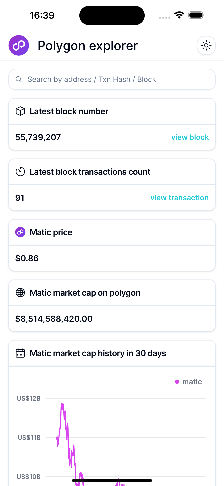
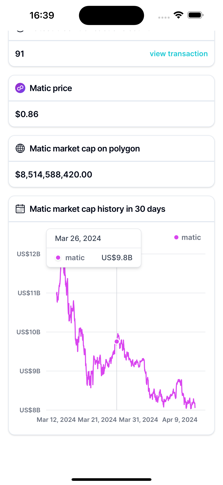
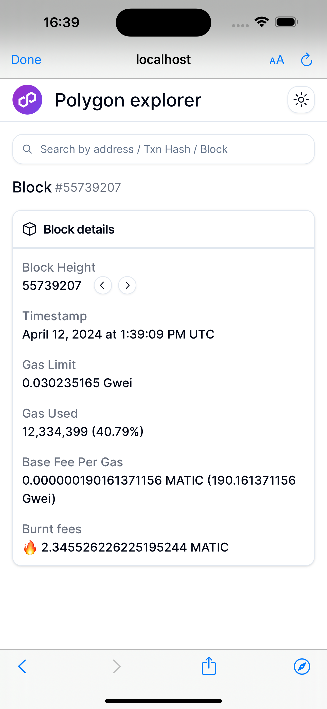
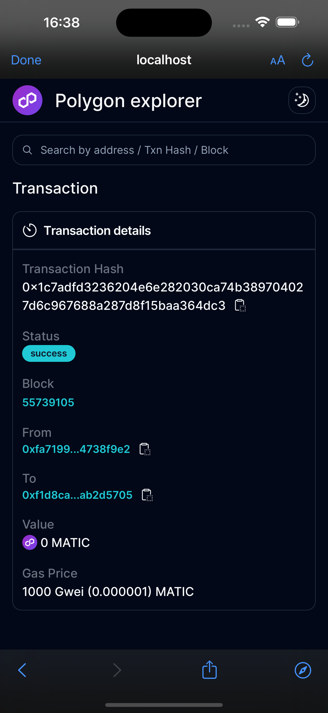
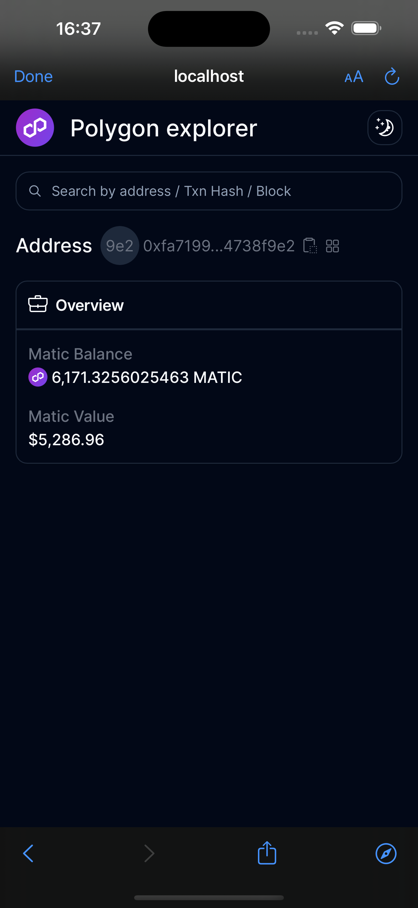
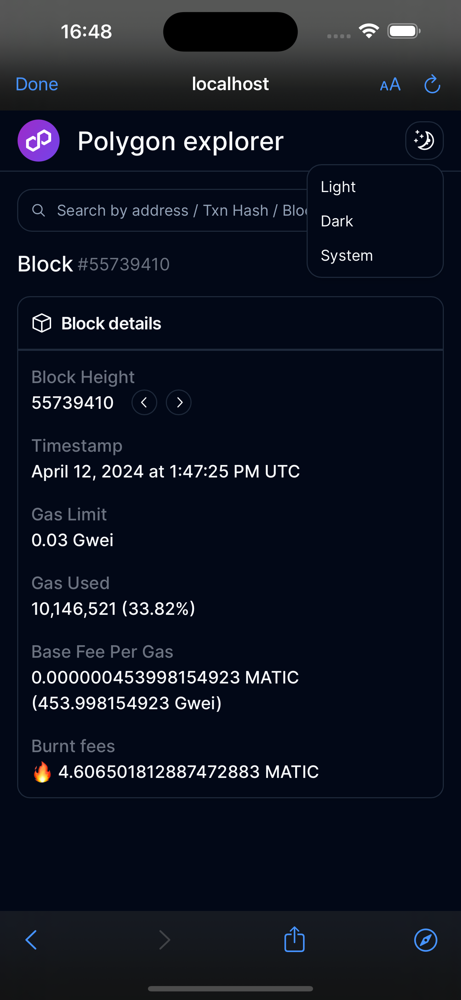

# web3-explorer

|                                   |                                  |                             |
| :-------------------------------: | :------------------------------: | :-------------------------: |
|         |  |  |
|  |          |  |

## Getting Started

First, run the development server:

```bash
npm run dev
```
