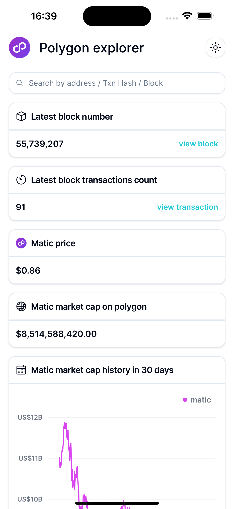
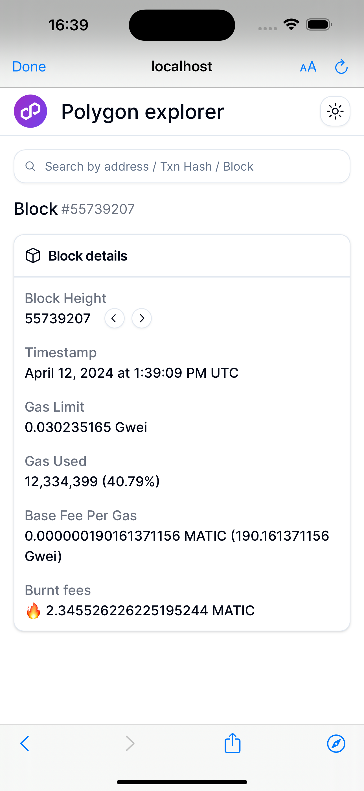
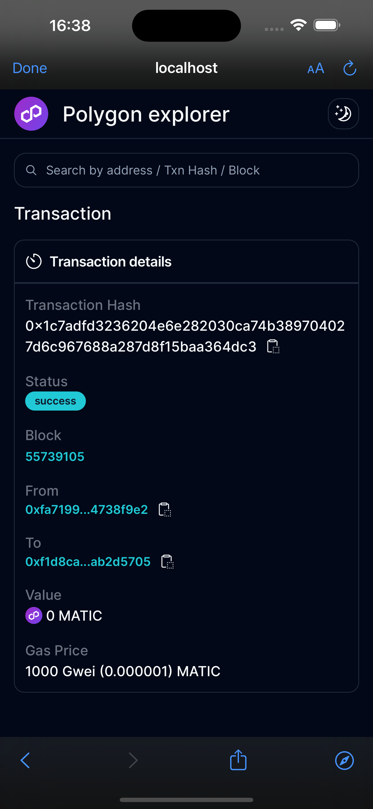
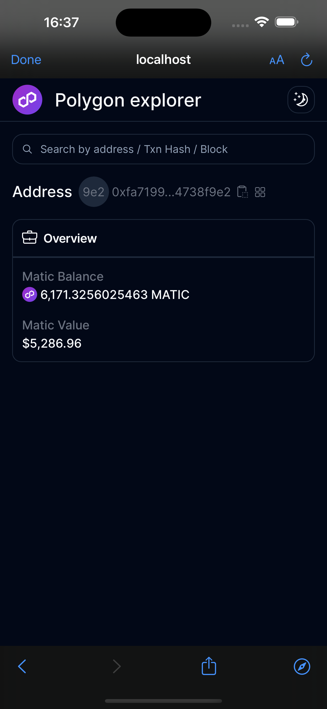
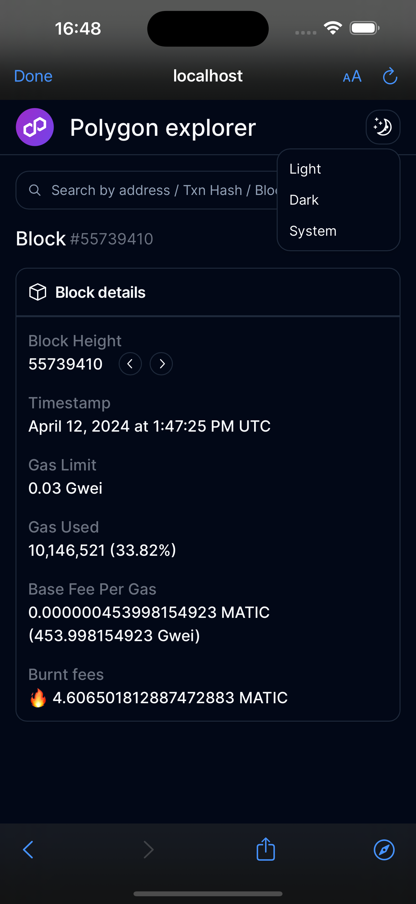

# web3-explorer

|                                          |                                         |                                    |
| :--------------------------------------: | :-------------------------------------: | :--------------------------------: |
|         |  |  |
|  |          |  |

## Getting Started

First, run the development server:

```bash
npm run dev
```
